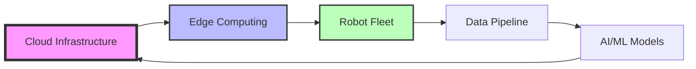
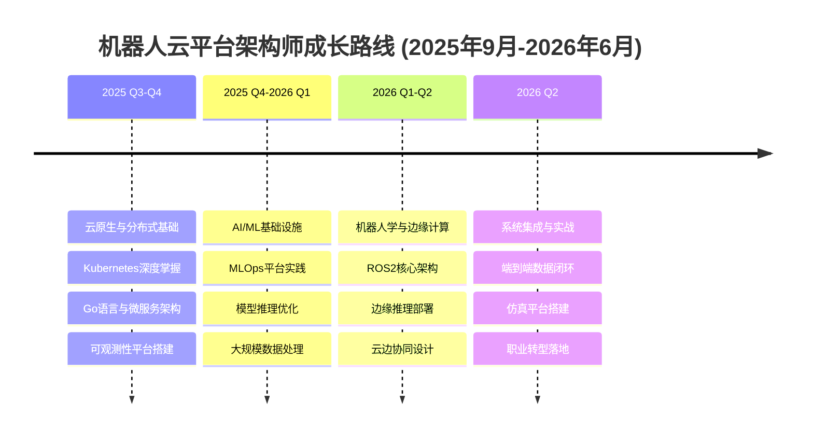
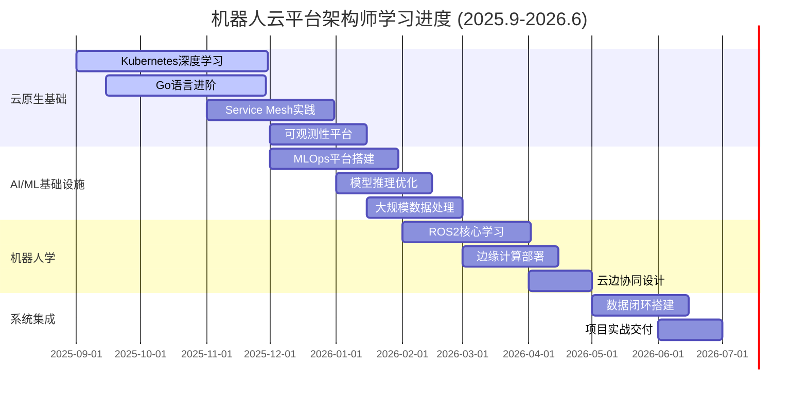

```
┌─────────────────────────────────────────────────────────────────┐
│                                                                 │
│    ██╗███╗   ██╗██╗  ██╗                                       │
│    ██║████╗  ██║██║ ██╔╝                                       │
│    ██║██╔██╗ ██║█████╔╝     🤖 ☁️ 🏗️                           │
│    ██║██║╚██╗██║██╔═██╗                                        │
│    ██║██║ ╚████║██║  ██╗                                       │
│    ╚═╝╚═╝  ╚═══╝╚═╝  ╚═╝                                       │
│                                                                 │
│           Robotics Cloud Platform Architect in Progress        │
│                                                                 │
└─────────────────────────────────────────────────────────────────┘
```

<div align="center">

[](https://git.io/typing-svg)

</div>

## 🎯 Career Mission

> **目标**: 在一年内成长为机器人云平台架构师，构建支撑千万级机器人的智能云基础设施

<div align="center">



</div>

## 🚀 Learning Roadmap (2025.9 - 2026.6)

<div align="center">



</div>

## 🛠️ Tech Stack & Learning Progress

### 🌩️ Cloud Native & Distributed Systems
<div align="center">


**进度**: 🟩🟩🟩🟩⬜ 80% - CKA认证进行中

</div>

### 🤖 Robotics & ROS
<div align="center">


**进度**: 🟩🟩⬜⬜⬜ 40% - ROS2基础学习中

</div>

### 🧠 AI/ML Infrastructure
<div align="center">


**进度**: 🟩🟩🟩⬜⬜ 60% - MLOps平台搭建中

</div>

### 📊 Data Engineering
<div align="center">


**进度**: 🟩🟩🟩⬜⬜ 60% - 流处理架构实践中

</div>

### 💻 Programming Languages
<div align="center">


</div>

## 📚 Current Learning Focus

<div align="center">

| 本月重点 | 学习资源 | 进度 |
|---------|---------|------|
| **Kubernetes Operator模式** | 《Programming Kubernetes》 | 📖 45% |
| **分布式系统设计** | 《Designing Data-Intensive Applications》 | 📖 62% |
| **ROS2核心概念** | ROS2 Official Documentation | 📖 30% |
| **Go并发编程** | 《Concurrency in Go》 | 📖 75% |

</div>

## 🏗️ Featured Projects

### 🎯 [RoboticsPlatform](https://github.com/ink-hz/RoboticsPlatform) - 机器人云管理平台 (MVP已完成)
> 基于Kubernetes的多机器人fleet管理平台

```yaml
技术栈:
  - Backend: Go + gRPC + Gin
  - Infrastructure: K8s + Istio + ArgoCD
  - Data: Kafka + Flink + MinIO
  - AI/ML: Kubeflow + TensorRT
  - Monitoring: Prometheus + Grafana + Loki
```

**核心功能**:
- ✅ 多机器人生命周期管理
- ✅ 实时数据流处理管道
- ✅ MVP基础架构完成
- 🚧 OTA模型更新系统
- 🚧 云边协同调度器
- ⏳ 数字孪生仿真环境

**项目地址**: [github.com/ink-hz/RoboticsPlatform](https://github.com/ink-hz/RoboticsPlatform)

### 🔧 Edge-Inference-Optimizer
> 边缘设备AI模型推理优化工具链

```python
支持设备:
  - NVIDIA Jetson系列
  - Raspberry Pi + Coral TPU
  - Intel NUC + OpenVINO
  
优化效果:
  - YOLOv8: 延迟降低 65%
  - ResNet50: 吞吐量提升 3.2x
```

## 📊 GitHub Analytics

<div align="center">


</div>

<div align="center">


</div>

## 🎓 Certifications & Achievements

<div align="center">

| 认证/成就 | 状态 | 目标日期 |
|----------|------|---------|
| **CKA (Certified Kubernetes Administrator)** | 🔄 准备中 | 2025 Q4 |
| **CKAD (Certified Kubernetes Application Developer)** | ⏳ 计划中 | 2026 Q1 |
| **AWS Solutions Architect** | ⏳ 计划中 | 2026 Q1 |
| **ROS2 Developer Certification** | ⏳ 计划中 | 2026 Q2 |

</div>

## 📝 Latest Blog Posts

```bash
# 博客建设中...
$ curl -s https://www.ink-hz.cn/api/posts | jq '.status'
{
  "status": "under_construction",
  "message": "正在整理机器人云平台架构相关技术博客",
  "planned_posts": [
    "构建千万级机器人云平台的架构设计",
    "Kubernetes Operator在机器人领域的实践",
    "边缘设备AI模型推理优化实战", 
    "ROS2与云原生架构的融合探索",
    "MLOps在机器人数据闭环中的应用"
  ],
  "expected_launch": "2025 Q4"
}
```

<div align="center">

**📚 即将发布**：深度技术博客正在创作中，敬请期待！

</div>

<!-- BLOG-POST-LIST:START -->
<!-- 博客文章将在这里自动更新 -->
<!-- BLOG-POST-LIST:END -->

## 💼 Professional Focus Areas

```python
class RoboticsCloudArchitect:
    def __init__(self):
        self.name = "ink"
        self.role = "Aspiring Robotics Cloud Platform Architect"
        self.location = "China"
        self.blog = "https://www.ink-hz.cn"
        
    def current_focus(self):
        return {
            "cloud_native": ["K8s Operators", "Service Mesh", "GitOps"],
            "robotics": ["ROS2", "SLAM", "Motion Planning"],
            "ai_infra": ["Model Serving", "Edge Inference", "MLOps"],
            "data_eng": ["Stream Processing", "Data Lake", "Time Series DB"]
        }
        
    def career_goals_2025_2026(self):
        return [
            "2025 Q4: 精通Kubernetes + Go，获得CKA认证",
            "2026 Q1: 掌握MLOps平台，通过CKAD和AWS SA认证", 
            "2026 Q2: 融合ROS2与云平台，成功转型机器人云架构师",
            "全程: 贡献3+开源项目，发表10+技术博客",
            "最终: 构建完整的机器人云-边-端数据闭环系统"
        ]
    
    def tech_philosophy(self):
        return """
        Infrastructure as Code | Data-Driven | Cloud-Edge-Device Synergy
        实践高于理论 | 架构服务业务 | 持续学习迭代
        """

architect = RoboticsCloudArchitect()
print(architect.tech_philosophy())
```

## 🌐 Connect & Collaborate

<div align="center">

[](https://www.ink-hz.cn)
[](https://github.com/ink-hz)
[](https://linkedin.com/in/ink-hz)
[](mailto:ink@example.com)

**开放合作**: 寻找机器人云平台、边缘计算、MLOps相关的开源项目合作机会

</div>

## 💭 Architecture Philosophy

<div align="center">

> *"The best architecture is not the most complex one, but the one that elegantly solves the problem at scale."*


</div>

## 📈 Learning Tracker

<div align="center">



</div>

---

<div align="center">
  
**[⭐ Star](https://github.com/ink-hz) | [🔱 Fork](https://github.com/ink-hz) | [👁️ Watch](https://github.com/ink-hz)**

*Building the future of robotics infrastructure, one commit at a time.*

</div>