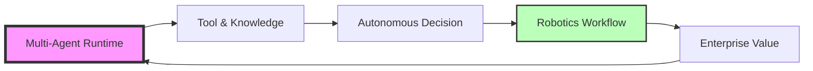

```
┌─────────────────────────────────────────────────────────────────┐
│                                                                 │
│    ██╗███╗   ██╗██╗  ██╗                                       │
│    ██║████╗  ██║██║ ██╔╝                                       │
│    ██║██╔██╗ ██║█████╔╝     🤖 ⚡ 🧠                           │
│    ██║██║╚██╗██║██╔═██╗                                        │
│    ██║██║ ╚████║██║  ██╗                                       │
│    ╚═╝╚═╝  ╚═══╝╚═╝  ╚═╝                                       │
│                                                                 │
│       Building the Real J.A.R.V.I.S. for Robotics               │
│                                                                 │
└─────────────────────────────────────────────────────────────────┘
```

<div align="center">

[](https://git.io/typing-svg)

</div>

## 🎯 Mission

> **目标**: 为机器人行业构建真正的 J.A.R.V.I.S. —— 企业级 AI Agent Runtime，让机器人拥有自主决策的智能大脑

<div align="center">


```mermaid
graph LR
    A[Multi-Agent Runtime] --> B[Tool & Knowledge]
    B --> C[Autonomous Decision]
    C --> D[Robotics Workflow]
    D --> E[Enterprise Value]
    E --> A
    style A fill:#f9f,stroke:#333,stroke-width:4px
    style D fill:#bfb,stroke:#333,stroke-width:2px
```

</div>

## 🤖 Jarvis — AI Agent Runtime for Robotics

**Jarvis** 是面向 Orbbec 机器人业务的企业级 AI Agent Runtime 系统，支持多领域 Agent 的统一运行、编排与治理。

```python
class Jarvis:
    """Enterprise AI Agent Runtime for Robotics"""

    def __init__(self):
        self.name = "J.A.R.V.I.S."
        self.mission = "Give robots an intelligent brain that actually works"

    def capabilities(self):
        return {
            "runtime": ["Multi-Agent Orchestration", "Autonomous Decision Loop", "Approval Workflow"],
            "knowledge": ["Structured Knowledge Fabric", "Metadata-Driven Retrieval", "Domain Knowledge Base"],
            "governance": ["L0-L3 Permission Engine", "Tool Hook System", "Full Audit Trail"],
            "agents": ["FAE Robot", "SDK Robot", "Quality Analyst", "R&D Assistant"],
        }

    def tech_stack(self):
        return {
            "core": ["Python", "FastAPI", "SQLAlchemy", "Alembic"],
            "llm": ["OpenAI-Compatible Client", "GLM-5.1", "Stub/Real Dual Mode"],
            "infra": ["PostgreSQL + pgvector", "Redis", "MinIO/S3", "Docker Compose"],
            "observability": ["OpenTelemetry", "Prometheus", "Grafana"],
        }

    def status(self):
        return "MVP-4 Pre-Stage → Agent Instantiation Phase"
```

## 🛠️ Tech Stack

### 🧠 AI/LLM Systems
<div align="center">


</div>

### 🌩️ Cloud Native & Infrastructure
<div align="center">


</div>

### 📊 Observability & Data
<div align="center">


</div>

### 💻 Programming Languages
<div align="center">


</div>

## 📝 Latest Blog Posts

> 技术博客: [www.inkbot.cn](http://www.inkbot.cn)

| 文章 | 方向 |
|------|------|
| **AI Agent Runtime 架构设计** | 多Agent编排、自主决策、权限治理 |
| **企业级 AI Agent 系统构建** | 知识体系、工具注册、审批流程 |
| **LLM x 机器人：智能体落地实践** | FAE Agent、SDK Agent、质量分析 |
| **向量数据库与知识检索深度指南** | 结构化知识、元数据驱动、RAG演进 |
| **Kubernetes与容器编排深度指南** | K8s架构、Operator模式、服务网格 |
| **可观测性与监控深度指南** | OpenTelemetry、链路追踪、Agent审计 |

## 💼 Current Focus

```python
class Ink:
    def __init__(self):
        self.name = "ink"
        self.role = "AI Agent Runtime Architect @ Orbbec"
        self.location = "China"
        self.blog = "http://www.inkbot.cn"

    def current_focus(self):
        return {
            "jarvis_runtime": ["Multi-Agent Loop", "Autonomous Decision Engine", "Approval Workflow"],
            "agent_instantiation": ["FAE Robot (Customer Support)", "SDK Robot", "Quality Analyst"],
            "knowledge_system": ["Structured Knowledge Fabric", "Metadata-Driven Retrieval"],
            "production": ["Observability", "Permission Governance", "Enterprise Integration"],
        }

    def philosophy(self):
        return "Build the J.A.R.V.I.S. that makes robots truly intelligent, not just automated."

me = Ink()
```

## 📊 GitHub Analytics

<div align="center">


</div>

<div align="center">


</div>

## 🌐 Connect

<div align="center">

[](http://www.inkbot.cn)
[](https://github.com/ink-hz)

**Open to collaborate on**: AI Agent Runtime, Robotics Intelligence, LLM tooling, Enterprise Agent Systems

</div>

---

<div align="center">

> *"Build the J.A.R.V.I.S. that makes robots truly intelligent, not just automated."*

</div>
