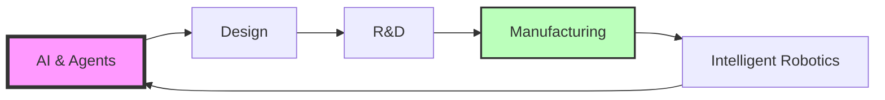

```
┌─────────────────────────────────────────────────────────────────┐
│                                                                 │
│    ███╗   ██╗███████╗ ██████╗                                  │
│    ████╗  ██║██╔════╝██╔═══██╗                                 │
│    ██╔██╗ ██║█████╗  ██║   ██║     🤖 ⚡ 🧠                    │
│    ██║╚██╗██║██╔══╝  ██║   ██║                                 │
│    ██║ ╚████║███████╗╚██████╔╝                                 │
│    ╚═╝  ╚═══╝╚══════╝ ╚═════╝                                  │
│                                                                 │
│       Exploring AI-Native Robotics Engineering                  │
│                                                                 │
└─────────────────────────────────────────────────────────────────┘
```

<div align="center">

[](https://git.io/typing-svg)

</div>

## 🎯 Mission

> **目标**：探索 AI 与机器人产业的深度融合，推动机器人从设计、研发到制造的全流程智能化。

<div align="center">


```mermaid
graph LR
    A[AI & Agents] --> B[Design]
    B --> C[R&D]
    C --> D[Manufacturing]
    D --> E[Intelligent Robotics]
    E --> A
    style A fill:#f9f,stroke:#333,stroke-width:4px
    style D fill:#bfb,stroke:#333,stroke-width:2px
```

</div>

## 🤖 AI-Native Robotics Engineering

我正在探索如何将 AI Agent、知识系统与工程工具融入机器人全生命周期，让复杂的设计、研发和制造流程变得更智能、更高效、更可靠。

```python
class RoboticsIntelligence:
    """Explore intelligent workflows for robotics engineering."""

    def __init__(self):
        self.mission = "Intelligence across the robotics lifecycle"

    def capabilities(self):
        return {
            "design": ["Assisted Design", "Knowledge Reuse", "Simulation"],
            "research": ["Engineering Copilot", "Experimentation", "Collaboration"],
            "manufacturing": ["Process Intelligence", "Quality", "Automation"],
            "foundation": ["AI Agents", "Knowledge Systems", "Data & Tools"],
        }

    def tech_stack(self):
        return {
            "core": ["Python", "FastAPI", "SQLAlchemy", "Alembic"],
            "llm": ["LLM", "RAG", "Agent Runtime"],
            "infra": ["PostgreSQL + pgvector", "Redis", "MinIO/S3", "Docker Compose"],
            "observability": ["OpenTelemetry", "Prometheus", "Grafana"],
        }

    def direction(self):
        return "From design to R&D and manufacturing"
```

## 🛠️ Tech Stack

### 🧠 AI/LLM Systems
<div align="center">


</div>

### 🌩️ Cloud Native & Infrastructure
<div align="center">


</div>

### 📊 Observability & Data
<div align="center">


</div>

### 💻 Programming Languages
<div align="center">


</div>

## 📝 Latest Blog Posts

> 技术博客: [www.inkbot.cn](http://www.inkbot.cn)

<!-- BLOG-POST-LIST:START -->
- [Agent 系统手册：从概念到工程实践](http://www.inkbot.cn/blog/agent%E5%AD%A6%E4%B9%A0%E7%B3%BB%E7%BB%9F%E6%89%8B%E5%86%8C-%E4%BB%8E%E6%A6%82%E5%BF%B5%E5%88%B0%E5%B7%A5%E7%A8%8B%E5%AE%9E%E8%B7%B5/)
- [AI 时代，程序员最该维护的不是代码，是身体](http://www.inkbot.cn/blog/ai%E6%97%B6%E4%BB%A3%E7%A8%8B%E5%BA%8F%E5%91%98%E7%9A%84%E6%9C%80%E5%BC%BA%E6%AD%A6%E5%99%A8-%E4%B8%8D%E6%98%AF%E9%94%AE%E7%9B%98%E6%98%AF%E4%BD%A0%E7%9A%84%E8%BA%AB%E4%BD%93/)
- [MetaBot 架构分析：AI Agent 的远程控制总线](http://www.inkbot.cn/blog/metabot%E6%9E%B6%E6%9E%84%E8%AE%BE%E8%AE%A1%E7%90%86%E8%AE%BA%E5%88%86%E6%9E%90/)
- [【交易圣经】五本经典真正讲的是同一件事：交易不是预测，而是生存系统](http://www.inkbot.cn/blog/%E4%BA%A4%E6%98%93%E5%9C%A3%E7%BB%8FTOP5-%E4%BA%94%E6%9C%AC%E4%B9%A6%E6%8F%90%E7%82%BC%E5%87%BA%E7%9A%84%E8%82%A1%E7%A5%A8%E4%BA%A4%E6%98%93%E6%A0%B8%E5%BF%83%E5%BF%83%E6%B3%95/)
- [【交易圣经】《以交易为生》：真正的交易系统，先管理自己，再管理仓位](http://www.inkbot.cn/blog/%E4%BB%A5%E4%BA%A4%E6%98%93%E4%B8%BA%E7%94%9F-%E4%B8%89%E9%87%8D%E6%BB%A4%E7%BD%91%E7%B3%BB%E7%BB%9F%E6%8A%8A%E4%BA%A4%E6%98%93%E4%BB%8E%E8%89%BA%E6%9C%AF%E5%8F%98%E6%88%90%E5%B7%A5%E7%A8%8B/)
<!-- BLOG-POST-LIST:END -->

## 💼 Current Focus

```python
class Ink:
    def __init__(self):
        self.name = "ink"
        self.role = "AI & Robotics Explorer"
        self.location = "China"
        self.blog = "http://www.inkbot.cn"

    def current_focus(self):
        return {
            "robotics_lifecycle": ["Design", "R&D", "Manufacturing"],
            "ai_agents": ["Reasoning", "Tools", "Workflow"],
            "knowledge_systems": ["Retrieval", "Context", "Knowledge Reuse"],
            "engineering": ["Reliability", "Observability", "Human-AI Collaboration"],
        }

    def philosophy(self):
        return "Make intelligence a native capability of robotics engineering."

me = Ink()
```

## 📊 GitHub Analytics

<div align="center">


</div>

<div align="center">


</div>

## 🌐 Connect

<div align="center">

[](http://www.inkbot.cn)
[](https://github.com/ink-hz)

**Open to collaborate on**: AI Agents, Robotics Intelligence, Engineering Workflows, Knowledge Systems

</div>

---

<div align="center">

> *"Make intelligence a native capability of robotics engineering."*

</div>
