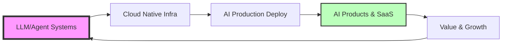

```
┌─────────────────────────────────────────────────────────────────┐
│                                                                 │
│    ██╗███╗   ██╗██╗  ██╗                                       │
│    ██║████╗  ██║██║ ██╔╝                                       │
│    ██║██╔██╗ ██║█████╔╝     🧠 ⚡ ☁️                           │
│    ██║██║╚██╗██║██╔═██╗                                        │
│    ██║██║ ╚████║██║  ██╗                                       │
│    ╚═╝╚═╝  ╚═══╝╚═╝  ╚═╝                                       │
│                                                                 │
│            AI Application Architect in Progress                 │
│                                                                 │
└─────────────────────────────────────────────────────────────────┘
```

<div align="center">

[](https://git.io/typing-svg)

</div>

## 🎯 Career Mission

> **目标**: 成为 AI 应用架构师，设计和构建生产级 AI 应用系统，探索 AI 时代个人开发者创业之路

<div align="center">


```mermaid
graph LR
    A[LLM/Agent Systems] --> B[Cloud Native Infra]
    B --> C[AI Production Deploy]
    C --> D[AI Products & SaaS]
    D --> E[Value & Growth]
    E --> A
    style A fill:#f9f,stroke:#333,stroke-width:4px
    style D fill:#bfb,stroke:#333,stroke-width:2px
```

</div>

## 🛠️ Tech Stack

### 🧠 AI/LLM Systems
<div align="center">


</div>

### 🌩️ Cloud Native & Distributed Systems
<div align="center">


</div>

### 📊 Data & Storage
<div align="center">


</div>

### 💻 Programming Languages
<div align="center">


</div>

## 📝 Latest Blog Posts

> 技术博客: [www.inkbot.cn](http://www.inkbot.cn)

| 文章 | 方向 |
|------|------|
| **AI/LLM 系统架构深度指南** | Agent架构、推理优化、RAG、生产部署 |
| **AI x 云原生：大规模AI应用架构** | GPU调度、动态负载、模型迭代 |
| **分布式系统架构深度指南** | 一致性、容错、分布式存储 |
| **向量数据库与RAG深度指南** | 向量检索、Embedding、RAG管线 |
| **Kubernetes与容器编排深度指南** | K8s架构、Operator模式、服务网格 |
| **可观测性与监控深度指南** | Prometheus、Grafana、链路追踪 |
| **云原生安全深度指南** | 零信任、身份认证、运行时安全 |
| **AI时代个人开发者创业指南** | AI产品、SaaS模式、独立开发 |

## 💼 Focus Areas

```python
class AIApplicationArchitect:
    def __init__(self):
        self.name = "ink"
        self.role = "AI Application Architect & Indie Developer"
        self.location = "China"
        self.blog = "http://www.inkbot.cn"

    def current_focus(self):
        return {
            "ai_systems": ["LLM Agent Architecture", "RAG Pipeline", "Inference Optimization"],
            "cloud_native": ["K8s for AI Workloads", "GPU Scheduling", "Service Mesh"],
            "data_infra": ["Vector Database", "Stream Processing", "Data Lake"],
            "building": ["AI-Powered SaaS Products", "Open Source Tools"]
        }

    def philosophy(self):
        return "Build AI systems that work in production, not just in notebooks."

architect = AIApplicationArchitect()
```

## 📊 GitHub Analytics

<div align="center">


</div>

<div align="center">


</div>

## 🌐 Connect

<div align="center">

[](http://www.inkbot.cn)
[](https://github.com/ink-hz)

**Open to collaborate on**: AI application architecture, LLM tooling, cloud native AI projects

</div>

---

<div align="center">

> *"Build AI systems that work in production, not just in notebooks."*

</div>
